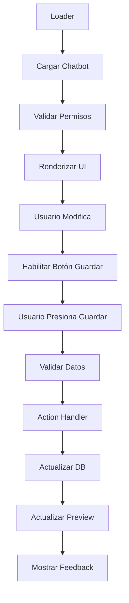

# Design Document

## Overview

El diseño se enfoca en conectar la interfaz existente de `chat/config` con los modelos de datos ya implementados, añadiendo funcionalidad real de carga, guardado manual y validación. Se implementará un sistema de guardado manual con validación en tiempo real y feedback visual para mejorar la experiencia del usuario.

## Architecture

### Component Structure

La pantalla de configuración se organizará en los siguientes componentes principales:

```
ChatConfigRoute
├── ChatConfigHeader (estado activo/inactivo)
├── ChatConfigTabs (navegación entre secciones)
├── ChatConfigPanel (formulario de configuración)
├── ChatPreview (preview en tiempo real)
└── ChatConfigFeedback (mensajes de estado)
```

### Data Flow



### State Management

Se utilizará React state local para:

- Datos del formulario (con tracking de cambios)
- Estado de UI (dropdowns, tabs activas)
- Estado de carga y errores
- Indicadores de cambios sin guardar

## Components and Interfaces

### Enhanced Loader Function

```typescript
export const loader = async ({ request, params }: Route.LoaderArgs) => {
  const url = new URL(request.url);
  const chatbotId = params.chatbotId || url.searchParams.get("chatbotId");

  // Get user from session
  const userId = await getUserOrNull(request);
  if (!userId) {
    throw redirect("/login");
  }

  // Get user plan for feature limitations
  const user = await getUserWithPlan(userId);

  let chatbot;
  if (chatbotId) {
    // Load specific chatbot
    chatbot = await getChatbotById(chatbotId, userId);
    if (!chatbot) {
      throw new Response("Chatbot not found", { status: 404 });
    }
  } else {
    // Load first active chatbot or create new one
    chatbot =
      (await getFirstActiveChatbot(userId)) ||
      (await createDefaultChatbot(userId));
  }

  return json({
    chatbot,
    user,
    availableModels: getAvailableModels(user.plan),
    personalities: getAvailablePersonalities(),
    planLimits: getPlanLimits(user.plan),
  });
};
```

### Enhanced Action Handler with Effect

```typescript
import { Effect, pipe } from "effect";

export const action = async ({ request }: Route.ActionArgs) => {
  const formData = await request.formData();
  const intent = formData.get("intent") as string;

  const program = pipe(
    Effect.tryPromise(() => getUserOrNull(request)),
    Effect.flatMap((userId) =>
      userId ? Effect.succeed(userId) : Effect.fail(new Error("Unauthorized"))
    ),
    Effect.flatMap((userId) => {
      switch (intent) {
        case "update_chatbot":
          return handleUpdateChatbotEffect(formData, userId);
        case "toggle_status":
          return handleToggleStatusEffect(formData, userId);
        case "manual_save":
          return handleManualSaveEffect(formData, userId);
        default:
          return Effect.fail(new Error("Invalid intent"));
      }
    }),
    Effect.catchAll((error) =>
      Effect.succeed({
        success: false,
        error: error.message,
        intent,
      })
    )
  );

  const result = await Effect.runPromise(program);

  if (!result.success) {
    const status =
      result.error === "Unauthorized"
        ? 401
        : result.error === "Invalid intent"
        ? 400
        : 500;
    return json(result, { status });
  }

  return json(result);
};
```

### Effect-based Handlers

```typescript
import { Effect, pipe } from "effect";

const handleUpdateChatbotEffect = (formData: FormData, userId: string) =>
  pipe(
    Effect.tryPromise(() => validateChatbotFormData(formData)),
    Effect.flatMap((validatedData) =>
      Effect.tryPromise(() => updateChatbotInDB(validatedData, userId))
    ),
    Effect.map((updatedChatbot) => ({
      success: true,
      data: updatedChatbot,
      intent: "update_chatbot",
    })),
    Effect.catchAll((error) =>
      Effect.succeed({
        success: false,
        error: error.message,
        intent: "update_chatbot",
      })
    )
  );

const handleToggleStatusEffect = (formData: FormData, userId: string) =>
  pipe(
    Effect.tryPromise(() => getChatbotById(formData.get("chatbotId"), userId)),
    Effect.flatMap((chatbot) =>
      chatbot
        ? Effect.succeed(chatbot)
        : Effect.fail(new Error("Chatbot not found"))
    ),
    Effect.flatMap((chatbot) =>
      Effect.tryPromise(() =>
        updateChatbotStatus(chatbot.id, !chatbot.isActive)
      )
    ),
    Effect.map((updatedChatbot) => ({
      success: true,
      data: updatedChatbot,
      intent: "toggle_status",
    }))
  );

const handleManualSaveEffect = (formData: FormData, userId: string) =>
  pipe(
    Effect.all([
      Effect.tryPromise(() => validateChatbotFormData(formData)),
      Effect.tryPromise(() => checkPlanLimits(userId, formData)),
    ]),
    Effect.flatMap(([validatedData, planCheck]) =>
      planCheck.isValid
        ? Effect.tryPromise(() => saveChatbotConfig(validatedData, userId))
        : Effect.fail(new Error(planCheck.error))
    ),
    Effect.map((savedChatbot) => ({
      success: true,
      data: savedChatbot,
      intent: "manual_save",
    }))
  );
```

### Manual Save Hook with Effect

```typescript
import { Effect, pipe } from "effect";

const useManualSave = (
  initialData: ChatbotData,
  planLimits: PlanLimits,
  onSave: (data: ChatbotData) => Promise<void>
) => {
  const [formData, setFormData] = useState(initialData);
  const [hasChanges, setHasChanges] = useState(false);
  const [isSaving, setIsSaving] = useState(false);
  const [errors, setErrors] = useState<Record<string, string>>({});

  const handleChange = useCallback(
    (field: string, value: any) => {
      setFormData((prev) => ({ ...prev, [field]: value }));
      setHasChanges(true);
      // Clear field-specific errors when user starts typing
      if (errors[field]) {
        setErrors((prev) => ({ ...prev, [field]: "" }));
      }
    },
    [errors]
  );

  const handleSave = useCallback(async () => {
    setIsSaving(true);
    setErrors({});

    const saveProgram = pipe(
      Effect.sync(() => validateChatbotData(formData, planLimits)),
      Effect.flatMap((validation) =>
        validation.isValid
          ? Effect.tryPromise(() => onSave(formData))
          : Effect.fail(new Error("Validation failed"))
      ),
      Effect.tap(() => Effect.sync(() => setHasChanges(false))),
      Effect.catchAll((error) =>
        Effect.sync(() => {
          if (error.message === "Validation failed") {
            const validation = validateChatbotData(formData, planLimits);
            setErrors(validation.errors);
          } else {
            setErrors({ general: error.message });
          }
        })
      ),
      Effect.ensuring(Effect.sync(() => setIsSaving(false)))
    );

    await Effect.runPromise(saveProgram);
  }, [formData, onSave, planLimits]);

  const resetChanges = useCallback(() => {
    setFormData(initialData);
    setHasChanges(false);
    setErrors({});
  }, [initialData]);

  return {
    formData,
    hasChanges,
    isSaving,
    errors,
    handleChange,
    handleSave,
    resetChanges,
  };
};
```

### Validation System

Se utilizará Zod para la validación de datos, siguiendo el patrón existente del proyecto:

```typescript
import { z } from "zod";

export const chatbotConfigSchema = z
  .object({
    name: z
      .string()
      .min(2, "El nombre debe tener al menos 2 caracteres")
      .max(50, "El nombre no puede exceder 50 caracteres"),

    personality: z.string().min(1, "Selecciona una personalidad"),

    welcomeMessage: z
      .string()
      .min(1, "El mensaje de bienvenida es requerido")
      .max(200, "El mensaje de bienvenida es muy largo"),

    aiModel: z.string().min(1, "Selecciona un modelo de IA"),

    temperature: z
      .number()
      .min(0, "La temperatura debe ser mayor o igual a 0")
      .max(1, "La temperatura debe ser menor o igual a 1"),

    prompt: z
      .string()
      .max(4000, "El prompt es muy largo, considera reducirlo")
      .optional(),

    primaryColor: z
      .string()
      .regex(/^#[0-9A-F]{6}$/i, "El color debe ser un código hex válido"),

    theme: z.union([z.literal("light"), z.literal("dark")]).default("light"),
  })
  .superRefine((data, ctx) => {
    // Custom validation for AI model based on plan limits
    // This will be injected during validation
  });

export type ChatbotConfigData = z.infer<typeof chatbotConfigSchema>;

const validateChatbotData = (
  data: ChatbotConfigData,
  planLimits: PlanLimits
) => {
  // Create dynamic schema with plan-specific validations
  const dynamicSchema = chatbotConfigSchema.superRefine((data, ctx) => {
    if (!planLimits.availableModels.includes(data.aiModel)) {
      ctx.addIssue({
        code: z.ZodIssueCode.custom,
        message: "Este modelo no está disponible en tu plan",
        path: ["aiModel"],
      });
    }
  });

  const result = dynamicSchema.safeParse(data);

  if (result.success) {
    return { isValid: true, errors: {}, data: result.data };
  } else {
    const errors: Record<string, string> = {};
    result.error.errors.forEach((error) => {
      const path = error.path.join(".");
      errors[path] = error.message;
    });
    return { isValid: false, errors, data: null };
  }
};
```

## Data Models

### Extended Chatbot Interface

```typescript
interface ChatbotConfigData {
  id: string;
  slug: string;
  name: string;
  description?: string;
  personality: string;
  welcomeMessage: string;
  aiModel: string;
  temperature: number;
  prompt: string;
  primaryColor: string;
  theme: string;
  status: ChatbotStatus;
  isActive: boolean;
  userId: string;
  createdAt: Date;
  updatedAt: Date;
}

interface PlanLimits {
  maxChatbots: number;
  maxContextSizeKB: number;
  maxConversationsPerMonth: number;
  availableModels: string[];
  showBranding: boolean;
}

interface ConfigFormState {
  data: ChatbotConfigData;
  hasChanges: boolean;
  isSaving: boolean;
  errors: Record<string, string>;
  warnings: Record<string, string>;
}
```

### API Response Types

```typescript
interface ConfigActionResponse {
  success: boolean;
  data?: ChatbotConfigData;
  error?: string;
  intent: string;
  validationErrors?: Record<string, string>;
}

interface LoaderData {
  chatbot: ChatbotConfigData;
  user: UserWithPlan;
  availableModels: ModelOption[];
  personalities: PersonalityOption[];
  planLimits: PlanLimits;
}
```

## Error Handling

### Validation Error Display

```typescript
const ValidationMessage = ({
  error,
  warning,
}: {
  error?: string;
  warning?: string;
}) => {
  if (error) {
    return (
      <div className="mt-1 text-sm text-red-600 dark:text-red-400 flex items-center gap-1">
        <ExclamationCircleIcon className="w-4 h-4" />
        {error}
      </div>
    );
  }

  if (warning) {
    return (
      <div className="mt-1 text-sm text-yellow-600 dark:text-yellow-400 flex items-center gap-1">
        <ExclamationTriangleIcon className="w-4 h-4" />
        {warning}
      </div>
    );
  }

  return null;
};
```

### Error Boundaries

Se implementarán error boundaries para capturar errores de componentes y mostrar fallbacks apropiados:

```typescript
const ConfigErrorBoundary = ({ children }: { children: React.ReactNode }) => {
  return (
    <ErrorBoundary
      fallback={({ error }) => (
        <div className="p-6 bg-red-50 dark:bg-red-900/20 rounded-lg">
          <h3 className="text-lg font-medium text-red-800 dark:text-red-200">
            Error en la configuración
          </h3>
          <p className="mt-2 text-red-600 dark:text-red-400">{error.message}</p>
          <button
            onClick={() => window.location.reload()}
            className="mt-4 px-4 py-2 bg-red-600 text-white rounded-md hover:bg-red-700"
          >
            Recargar página
          </button>
        </div>
      )}
    >
      {children}
    </ErrorBoundary>
  );
};
```

## Performance Considerations

### Optimizations

1. **Form State Management**: Optimizar el tracking de cambios sin llamadas innecesarias
2. **Memoized Components**: Usar React.memo para componentes que no cambian frecuentemente
3. **Lazy Loading**: Cargar pestañas bajo demanda
4. **Optimistic Updates**: Actualizar preview inmediatamente al cambiar valores

### Caching Strategy

- Cache de datos del chatbot en sessionStorage para navegación rápida
- Invalidación de cache al guardar cambios
- Prefetch de datos relacionados (conversaciones, contextos)

## Security Considerations

### Authorization

- Verificar ownership del chatbot en cada operación
- Validar permisos de plan antes de permitir cambios
- Sanitizar datos de entrada

### Data Validation

- Validación tanto en cliente como servidor
- Escape de contenido HTML en prompts
- Límites de tamaño para prevenir ataques DoS
