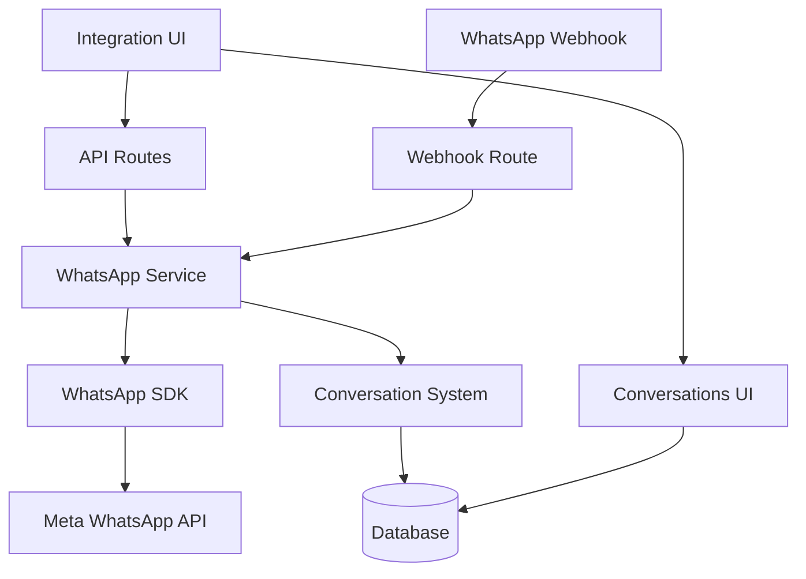
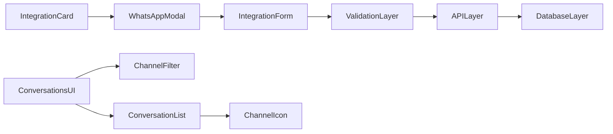
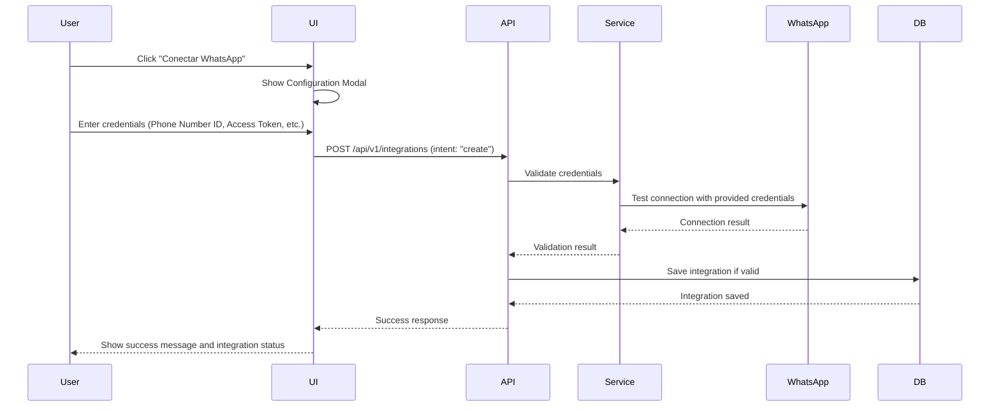

# Design Document

## Overview

Esta funcionalidad implementará una integración completa de **WhatsApp Cloud API** con el sistema de chatbots existente. El diseño se enfoca en reutilizar la infraestructura existente (conversaciones, mensajes, UI) mientras agrega las capacidades específicas de WhatsApp de manera seamless.

**¿Por qué WhatsApp Cloud API?**

- Más fácil de implementar y mantener que On-Premises
- No requiere infraestructura propia para manejar webhooks
- Soporte nativo para Embedded Signup
- Escalabilidad automática manejada por Meta
- Actualizaciones automáticas de la API

La arquitectura seguirá el patrón de React Router v7 con rutas de recursos para el CRUD de integraciones y manejo de webhooks, integrándose con el WhatsApp SDK existente (que ya usa `graph.facebook.com`) y el servicio de WhatsApp ya implementado.

## Architecture

### High-Level Architecture



### Component Architecture



### Data Flow

#### Manual Configuration Flow



## Components and Interfaces

### 1. UI Components

#### WhatsAppIntegrationModal

```typescript
interface WhatsAppIntegrationModalProps {
  isOpen: boolean;
  onClose: () => void;
  chatbotId: string;
  existingIntegration?: Integration | null;
  onSuccess: (integration: Integration) => void;
}

// Manual configuration form data
interface WhatsAppFormData {
  phoneNumberId: string;
  accessToken: string;
  businessAccountId: string;
  webhookVerifyToken?: string;
}

// Form validation state
interface FormValidationState {
  phoneNumberId: { isValid: boolean; error?: string };
  accessToken: { isValid: boolean; error?: string };
  businessAccountId: { isValid: boolean; error?: string };
  webhookVerifyToken: { isValid: boolean; error?: string };
}
```

#### Enhanced IntegrationCard

```typescript
interface IntegrationCardProps {
  name: string;
  logo: string;
  description: string;
  cta?: string; // Default: "Conectar"
  status?: "connected" | "disconnected" | "error";
  lastActivity?: string;
  onConnect?: () => void; // Opens manual configuration modal
  onManage?: () => void; // Opens management options (edit, disconnect)
}
```

#### ConversationChannelIndicator

```typescript
interface ChannelIndicatorProps {
  channel: "web" | "whatsapp" | "telegram";
  phoneNumber?: string; // for WhatsApp conversations
  className?: string;
}
```

### 2. API Routes

#### Integration CRUD Route (`app/routes/api.v1.integrations.ts`)

```typescript
import type { Route } from "./+types/api.v1.integrations";

export const loader = async ({ request }: Route.LoaderArgs) => {
  // GET: Fetch integrations for a chatbot
  // Query params: chatbotId
  // Returns: Integration[]
};

export const action = async ({ request }: Route.ActionArgs) => {
  // Handle different intents via FormData
  // POST: Create integration (intent: "create")
  // PUT: Update integration (intent: "update")
  // DELETE: Delete integration (intent: "delete")
  // POST: Test connection (intent: "test")
};
```

#### WhatsApp Webhook Route (`app/routes/api.whatsapp.webhook.ts`)

```typescript
import type { Route } from "./+types/api.whatsapp.webhook";

export const action = async ({ request }: Route.ActionArgs) => {
  // Handle WhatsApp webhook POST requests
  // 1. Verify webhook signature
  // 2. Process incoming messages
  // 3. Generate chatbot responses
  // 4. Send responses back to WhatsApp
  // 5. Update conversation records
};

export const loader = async ({ request }: Route.LoaderArgs) => {
  // Handle WhatsApp webhook verification (GET)
  // Verify webhook setup with Meta
};
```

### 3. Service Layer Integration

#### WhatsApp Integration Service

```typescript
interface WhatsAppIntegrationService {
  createIntegration(data: CreateIntegrationData): Promise<Integration>;
  updateIntegration(
    id: string,
    data: UpdateIntegrationData
  ): Promise<Integration>;
  deleteIntegration(id: string): Promise<void>;
  testConnection(integration: Integration): Promise<ConnectionTestResult>;
  processIncomingMessage(webhook: WhatsAppWebhook): Promise<void>;
}

interface CreateIntegrationData {
  chatbotId: string;
  phoneNumberId: string;
  accessToken: string;
  businessAccountId: string;
  webhookVerifyToken?: string;
}

interface UpdateIntegrationData {
  phoneNumberId?: string;
  accessToken?: string;
  businessAccountId?: string;
  webhookVerifyToken?: string;
  isActive?: boolean;
}

interface ConnectionTestResult {
  success: boolean;
  message: string;
  details?: {
    phoneNumber: string;
    businessName: string;
    verificationStatus: string;
  };
}
```

### 4. Database Schema Extensions

#### Integration Model (existing)

```prisma
model Integration {
  id       String          @id @default(auto()) @map("_id") @db.ObjectId
  platform IntegrationType // WHATSAPP, TELEGRAM
  token    String?         // Access token
  isActive Boolean         @default(false)

  // New fields for WhatsApp
  phoneNumberId      String?
  businessAccountId  String?
  webhookVerifyToken String?
  lastActivity       DateTime?
  errorMessage       String?


  // Relations
  chatbotId String  @db.ObjectId
  chatbot   Chatbot @relation(fields: [chatbotId], references: [id])

  createdAt DateTime @default(now())
  updatedAt DateTime @updatedAt
}
```

#### Conversation Model (existing - no changes needed)

```prisma
model Conversation {
  id        String @id @default(auto()) @map("_id") @db.ObjectId
  sessionId String @unique

  // Visitor info - will store WhatsApp phone number in visitorId
  visitorIp String?
  visitorId String? // For WhatsApp: phone number

  // Conversation state
  status       ConversationStatus @default(ACTIVE)
  startedAt    DateTime           @default(now())
  endedAt      DateTime?
  messageCount Int                @default(0)
  isFavorite   Boolean            @default(false)

  // Relations
  chatbotId String    @db.ObjectId
  chatbot   Chatbot   @relation(fields: [chatbotId], references: [id])
  messages  Message[]

  createdAt DateTime @default(now())
  updatedAt DateTime @updatedAt
}
```

#### Message Model (existing - minimal changes)

```prisma
model Message {
  id      String      @id @default(auto()) @map("_id") @db.ObjectId
  content String
  role    MessageRole
  deleted Boolean     @default(false)
  picture String?

  // Metadata - add channel info
  channel           String? // 'web', 'whatsapp', 'telegram'
  externalMessageId String? // WhatsApp message ID
  tokens            Int?    // for usage tracking
  responseTime      Int?    // in milliseconds
  firstTokenLatency Int?    // time to first chunk in milliseconds

  // Relations
  conversationId String       @db.ObjectId
  conversation   Conversation @relation(fields: [conversationId], references: [id])

  createdAt DateTime @default(now())
}
```

## Data Models

### WhatsApp Configuration Model

```typescript
interface WhatsAppConfig {
  phoneNumberId: string;
  accessToken: string;
  businessAccountId: string;
  webhookVerifyToken?: string;
  apiVersion: string;
  baseUrl: string;
}
```

### Integration Status Model

```typescript
interface IntegrationStatus {
  id: string;
  platform: "WHATSAPP" | "TELEGRAM";
  status: "connected" | "disconnected" | "error";
  isActive: boolean;
  lastActivity?: Date;
  errorMessage?: string;
  connectionDetails?: {
    phoneNumber: string;
    businessName: string;
    verificationStatus: string;
  };
}
```

### WhatsApp Message Processing Model

```typescript
interface WhatsAppIncomingMessage {
  messageId: string;
  from: string; // Phone number
  to: string; // Business phone number ID
  body: string;
  timestamp: string;
  type: "text" | "image" | "document" | "audio" | "video";
  mediaId?: string;
}

interface WhatsAppOutgoingMessage {
  to: string;
  type: "text" | "image" | "document";
  content: string;
  mediaId?: string;
  caption?: string;
}
```

## Error Handling

### Error Types

```typescript
enum IntegrationErrorType {
  INVALID_CREDENTIALS = "INVALID_CREDENTIALS",
  CONNECTION_FAILED = "CONNECTION_FAILED",
  WEBHOOK_VERIFICATION_FAILED = "WEBHOOK_VERIFICATION_FAILED",
  MESSAGE_SEND_FAILED = "MESSAGE_SEND_FAILED",
  RATE_LIMIT_EXCEEDED = "RATE_LIMIT_EXCEEDED",
  INVALID_PHONE_NUMBER = "INVALID_PHONE_NUMBER",
}

interface IntegrationError {
  type: IntegrationErrorType;
  message: string;
  details?: unknown;
  timestamp: Date;
}
```

### Error Handling Strategy

1. **Validation Errors**: Show inline form validation with specific field errors
2. **Connection Errors**: Display user-friendly messages with retry options
3. **Webhook Errors**: Log errors and attempt to process with fallback mechanisms
4. **Rate Limiting**: Implement exponential backoff and user notifications
5. **Message Failures**: Store failed messages for retry and notify users

## Security Considerations

### Webhook Security

- Verify webhook signatures using HMAC-SHA256
- Validate webhook payload structure
- Rate limiting on webhook endpoint
- Log suspicious webhook attempts

### Credential Management

- Store access tokens encrypted in database
- Never expose tokens in client-side code
- Implement token rotation capabilities
- Validate token permissions with WhatsApp API

### Data Privacy

- Mask phone numbers in UI (show only last 4 digits)
- Implement data retention policies for messages
- Ensure GDPR compliance for user data
- Secure transmission of all sensitive data

## Cost Information (User Pays Meta Directly)

### WhatsApp Business API Pricing Information

**Modelo de negocio**: El usuario conecta su propia cuenta de WhatsApp Business y Meta le cobra directamente. Nuestra plataforma solo facilita la conexión.

#### Información de Precios para Mostrar al Usuario

WhatsApp cobra por conversaciones (ventanas de 24 horas), no por mensajes individuales:

**Rangos de precios por tipo de conversación:**

- **Service** (usuario inicia): $0.005 - $0.015 USD
- **Marketing** (negocio inicia): $0.0055 - $0.0165 USD
- **Utility** (notificaciones): $0.0025 - $0.0105 USD
- **Authentication** (verificación): $0.0005 - $0.0095 USD

_Los precios varían por país. Meta factura directamente al usuario._

#### Componente de Información de Costos

```typescript
interface CostInfoProps {
  showPricingInfo: boolean;
  onLearnMore: () => void; // Link a documentación de Meta
}
```

## Configuration Requirements

### Environment Variables for WhatsApp Cloud API Integration

```bash
# WhatsApp Cloud API Configuration (existing)
WHATSAPP_API_VERSION=v17.0
WHATSAPP_BASE_URL=https://graph.facebook.com

# Webhook configuration (for receiving messages)
WHATSAPP_WEBHOOK_VERIFY_TOKEN=your_webhook_verify_token

# Optional: Default values for testing
WHATSAPP_PHONE_NUMBER_ID=your_phone_number_id
WHATSAPP_ACCESS_TOKEN=your_access_token
WHATSAPP_BUSINESS_ACCOUNT_ID=your_business_account_id
```

### WhatsApp Cloud API: La Única Opción Disponible

**WhatsApp Cloud API es la única opción viable porque:**

1. **WhatsApp On-Premises API fue descontinuada** (sunset en octubre 2023)
2. **Migración obligatoria**: Meta requiere que todos migren a Cloud API
3. **Nuevas funcionalidades**: Solo disponibles en Cloud API (como Embedded Signup)
4. **Soporte**: Meta solo brinda soporte para Cloud API
5. **Futuro**: Todas las nuevas features solo estarán en Cloud API
6. **Compatibilidad**: Nuestro SDK existente ya usa `graph.facebook.com`

**Beneficios adicionales de Cloud API:**

- No necesitamos mantener infraestructura propia
- Escalabilidad automática manejada por Meta
- Actualizaciones automáticas de la API
- Mejor seguridad y compliance
- OAuth2 Embedded Signup para onboarding simplificado

## Performance Considerations

### Webhook Processing

- Process webhooks asynchronously when possible
- Implement queue system for high-volume scenarios
- Cache frequently accessed integration data
- Optimize database queries for conversation lookups

### UI Performance

- Lazy load integration modals
- Implement optimistic updates for status changes
- Cache integration status in client state
- Debounce form validation

### Database Optimization

- Index frequently queried fields (chatbotId, platform, isActive)
- Implement pagination for conversation lists
- Optimize message queries with proper indexing
- Consider archiving old conversations

## Monitoring and Observability

### Metrics to Track

- Integration creation/deletion rates
- Webhook processing latency
- Message delivery success rates
- Error rates by type
- API response times

### Logging Strategy

- Log all integration CRUD operations
- Track webhook processing steps
- Monitor WhatsApp API rate limits
- Log user actions for audit trail

### Alerting

- Alert on webhook processing failures
- Monitor integration connection health
- Track unusual error patterns
- Alert on rate limit approaches

## Migration Strategy

### Database Migration

- Add new fields to Integration model
- Add channel field to Message model
- Create indexes for new query patterns
- Migrate existing data if needed

### Feature Rollout

1. Deploy backend changes first
2. Enable WhatsApp integration for beta users
3. Monitor system performance and error rates
4. Gradually roll out to all users
5. Deprecate any temporary workarounds

### Rollback Plan

- Feature flags for quick disabling
- Database rollback scripts prepared
- Monitoring for system degradation
- Communication plan for users
