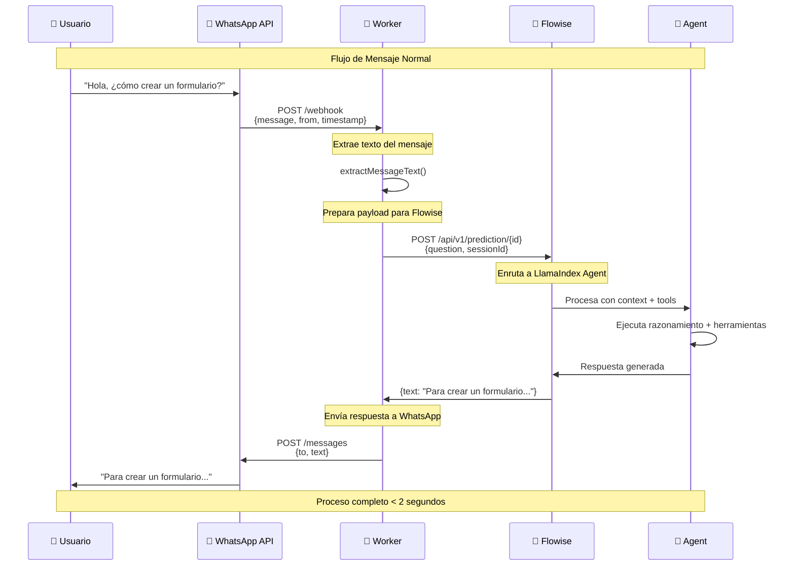
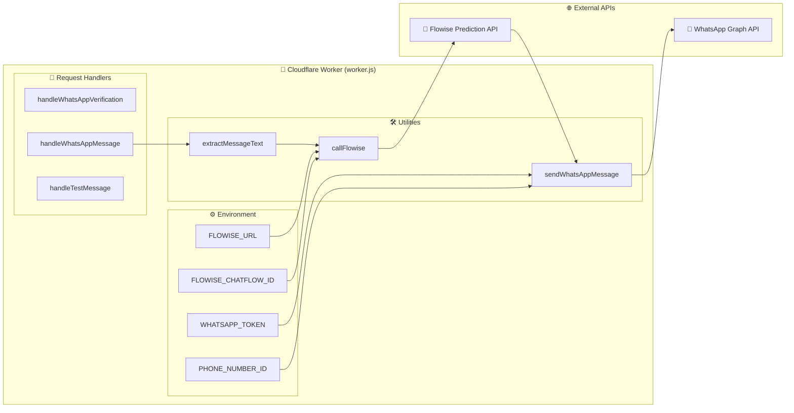
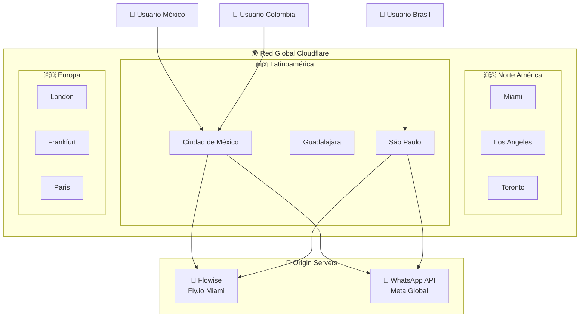
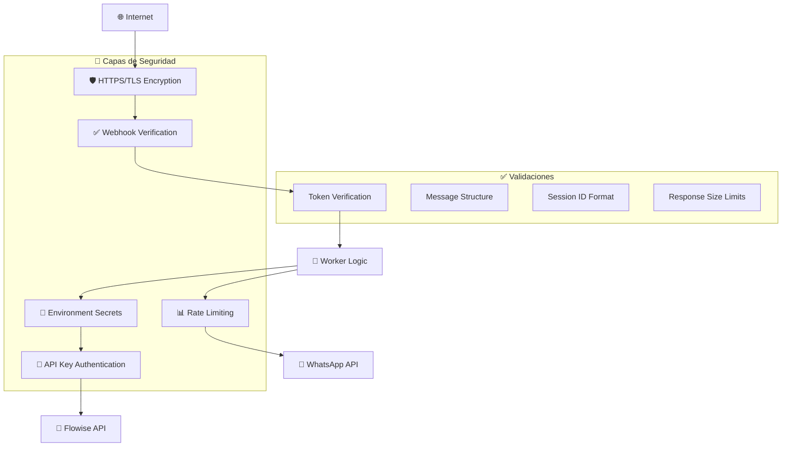
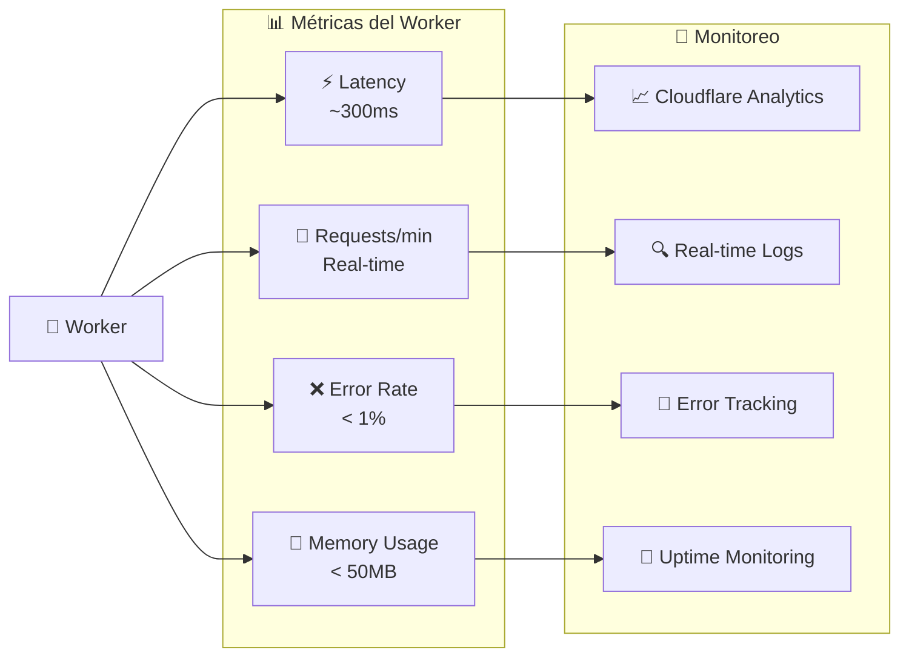
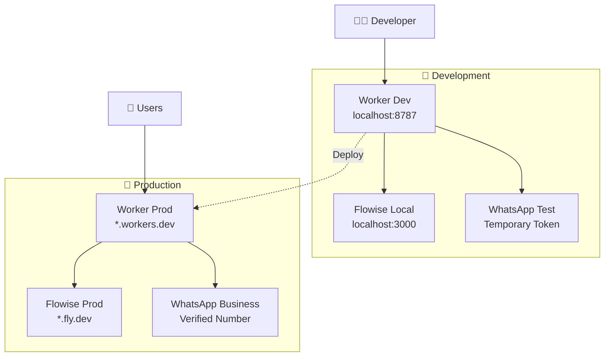
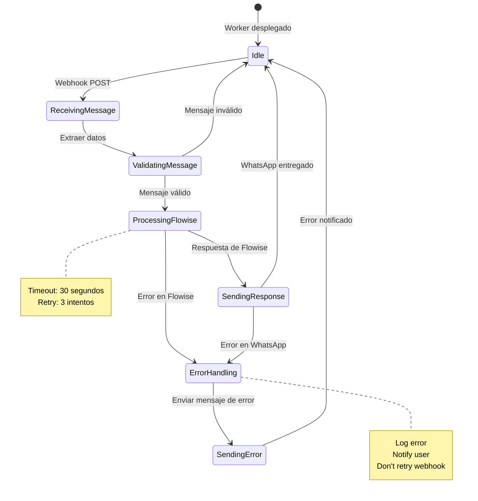

# 🏗️ Arquitectura WhatsApp + Flowise Bridge

## 📊 Diagrama de Flujo Completo

```mermaid
graph TB
    %% Usuario y WhatsApp
    User[👤 Usuario WhatsApp]
    WA[📱 WhatsApp Business API<br/>Meta/Facebook]

    %% Cloudflare Worker
    subgraph CF["☁️ Cloudflare Edge (300+ ubicaciones)"]
        Worker[🔧 Worker Bridge<br/>formmy-whatsapp-bridge]

        subgraph Endpoints["📡 Endpoints"]
            EP1[GET /webhook<br/>Verificación]
            EP2[POST /webhook<br/>Mensajes]
            EP3[GET /health<br/>Status]
            EP4[POST /test<br/>Testing]
        end
    end

    %% Flowise
    subgraph Flowise["🤖 Flowise Instance"]
        FlowAPI[📋 Prediction API<br/>/api/v1/prediction/{id}]
        Agent[🧠 LlamaIndex Agent<br/>GPT-5 Nano + Tools]
        Memory[💾 Session Memory<br/>Chat History]
    end

    %% Flujo de datos
    User -->|1. Envía mensaje| WA
    WA -->|2. Webhook POST| EP2
    EP2 -->|3. Procesa mensaje| Worker
    Worker -->|4. API Call| FlowAPI
    FlowAPI -->|5. Ejecuta agent| Agent
    Agent -->|6. Respuesta AI| FlowAPI
    FlowAPI -->|7. JSON response| Worker
    Worker -->|8. Send message| WA
    WA -->|9. Entrega respuesta| User

    %% Configuración inicial
    WA -.->|Verificación inicial| EP1

    %% Testing
    Developer[👨‍💻 Developer] -.->|Testing| EP4
    Monitor[📊 Monitoring] -.->|Health check| EP3

    %% Estilos
    classDef user fill:#e1f5fe
    classDef whatsapp fill:#25d366,color:#fff
    classDef worker fill:#f97316,color:#fff
    classDef flowise fill:#8b5cf6,color:#fff
    classDef endpoint fill:#06b6d4,color:#fff

    class User user
    class WA whatsapp
    class Worker,CF worker
    class FlowAPI,Agent,Memory,Flowise flowise
    class EP1,EP2,EP3,EP4 endpoint
```

## 🔄 Secuencia Detallada de Procesamiento



## 🏭 Arquitectura de Componentes Internos



## 🌍 Distribución Global



## 🔐 Flujo de Seguridad



## 📊 Métricas y Monitoreo



## 🎛️ Configuración de Entornos



## 🔄 Estados del Sistema



---

## 📋 Resumen de la Arquitectura

### ⚡ **Edge Computing**
- **300+ ubicaciones** globales
- **0ms cold start** (siempre caliente)
- **Auto-scaling** infinito

### 🔄 **Request Flow**
1. Usuario → WhatsApp → Worker (300ms)
2. Worker → Flowise → Agent (500ms)
3. Agent → Worker → WhatsApp → Usuario (200ms)
4. **Total: ~1 segundo**

### 💰 **Costo Optimizado**
- Worker: **$0** (100K requests gratis)
- WhatsApp: **$0.0085/mensaje**
- Flowise: Según hosting

### 🛡️ **Seguridad Robusta**
- HTTPS/TLS encryption
- Environment secrets
- Webhook verification
- Rate limiting automático
