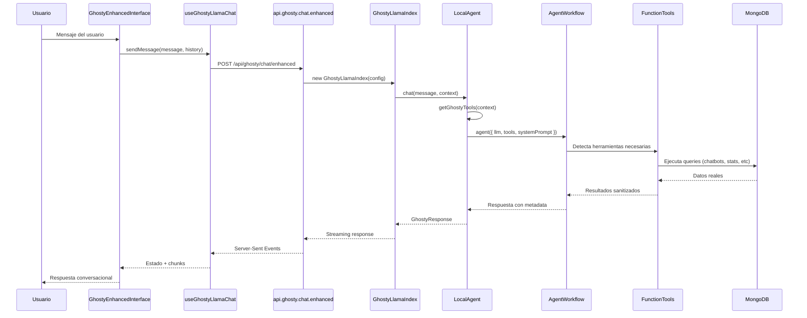

# Ghosty - Reporte Técnico Completo
## Implementación LlamaIndex 2025 para Agente Conversacional

### Resumen Ejecutivo

Ghosty es el agente conversacional principal de Formmy, implementado siguiendo los patrones oficiales de LlamaIndex 2025. Este reporte documenta la arquitectura completa, flujo de datos, y cada componente del sistema para facilitar la extrapolación a componentes opensource como hchat.

---

## 1. Arquitectura General

### 1.1 Stack Tecnológico
```
┌─────────────────────────────────────────────────────────────┐
│                    Frontend (React Router v7)               │
├─────────────────────────────────────────────────────────────┤
│  GhostyEnhancedInterface → useGhostyLlamaChat → /api        │
├─────────────────────────────────────────────────────────────┤
│                    Backend (Node.js/Express)               │
├─────────────────────────────────────────────────────────────┤
│  api.ghosty.chat.enhanced → GhostyLlamaIndex → Local Agent │
├─────────────────────────────────────────────────────────────┤
│                    Agent Framework (LlamaIndex)            │
├─────────────────────────────────────────────────────────────┤
│  agent() → AgentWorkflow → FunctionAgent → Tools           │
├─────────────────────────────────────────────────────────────┤
│                    Database & External APIs                │
└─────────────────────────────────────────────────────────────┘
```

### 1.2 Estructura de Directorios
```
/server/ghosty-llamaindex/
├── index.ts                    # Factory principal
├── config.ts                   # Configuraciones por modelo
├── types.ts                    # Interfaces TypeScript
├── agents/
│   ├── local-agent.ts         # Implementación principal
│   ├── remote-agent.ts        # Fallback remoto
│   └── agent-factory.ts       # Factory pattern
└── tools/
    ├── index.ts               # Registry de herramientas
    ├── chatbot-query.ts       # CRUD chatbots
    ├── stats-query.ts         # Métricas y análisis
    └── web-search.ts          # Búsqueda web
```

---

## 2. Flujo de Datos Completo

### 2.1 Flujo Principal (Step by Step)



### 2.2 Gestión de Estado en Tiempo Real

#### Frontend State Flow
```typescript
// 1. Estado inicial
const [messages, setMessages] = useState<ChatMessage[]>([]);
const [isLoading, setIsLoading] = useState(false);
const [toolsInProgress, setToolsInProgress] = useState<string[]>([]);

// 2. Server-Sent Events handling
useEffect(() => {
  const eventSource = new EventSource('/api/ghosty/chat/enhanced');
  
  eventSource.onmessage = (event) => {
    const data = JSON.parse(event.data);
    
    switch (data.type) {
      case 'status':
        setStatus(data.message); // "🤔 Analizando tu pregunta..."
        break;
      case 'tool-start':
        setToolsInProgress(prev => [...prev, data.tool]);
        break;
      case 'tool-complete':
        setToolsInProgress(prev => prev.filter(t => t !== data.tool));
        break;
      case 'chunk':
        appendToCurrentMessage(data.content);
        break;
      case 'done':
        setIsLoading(false);
        break;
    }
  };
}, []);
```

---

## 3. Componentes Principales

### 3.1 GhostyLocalAgent (Cerebro principal)

**Responsabilidades:**
- Inicialización del LLM (OpenAI/Anthropic)
- Creación de AgentWorkflow con herramientas contextuales
- Manejo de conversación e historial
- Procesamiento de respuestas y metadata

**Patrón de Implementación:**
```typescript
export class GhostyLocalAgent {
  private config: GhostyConfig;
  private llm: any;
  private agentWorkflow: any;

  async chat(message: string, context: GhostyContext): Promise<GhostyResponse> {
    // 1. Obtener herramientas para el contexto
    const tools = getGhostyTools(context);
    
    // 2. Crear AgentWorkflow (patrón LlamaIndex 2025)
    this.agentWorkflow = agent({
      name: 'ghosty',
      llm: this.llm,
      tools: tools,
      systemPrompt: contextualPrompt,
      description: 'Asistente inteligente de Formmy',
      verbose: true
    });
    
    // 3. Ejecutar workflow con historial
    const workflowResult = await this.agentWorkflow.run(message, {
      chatHistory: chatHistory
    });
    
    // 4. Procesar respuesta
    return {
      content: workflowResult.data.result,
      toolsUsed: workflowResult.data.toolsUsed,
      sources: this.buildSourcesFromWorkflow(workflowResult),
      metadata: { processingTime, model, llamaIndexWorkflow: true }
    };
  }
}
```

### 3.2 Context-Aware Tool System

**Problema Resuelto:** LlamaIndex `FunctionTool.from` no pasa context como parámetro adicional.

**Solución Implementada:**
```typescript
// ❌ Patrón incorrecto (causaba loops infinitos)
FunctionTool.from(async (params, context) => { ... }, metadata)

// ✅ Patrón correcto (closures con context capturado)
function getGhostyTools(context: GhostyContext): BaseTool<any>[] {
  const contextAwareQueryChatbots = FunctionTool.from(
    async (params: any) => {
      // Context capturado en closure
      return await queryChatbotsCore(params, context);
    },
    {
      name: 'query_chatbots',
      description: 'Query user\'s chatbots with filters',
      parameters: { /* JSON Schema */ }
    }
  );
  
  return [contextAwareQueryChatbots, ...otherTools];
}
```

**Funciones Core Separadas:**
```typescript
// Función core que maneja la lógica real
async function queryChatbotsCore(
  params: { filters?: any; includeStats?: boolean }, 
  context: GhostyContext
): Promise<any[]> {
  if (!context?.userId) {
    throw new Error("User context is required");
  }
  
  const prisma = await getPrisma();
  const chatbots = await prisma.chatbot.findMany({
    where: { userId: context.userId, ...params.filters }
  });
  
  // Sanitizar datos para LlamaIndex (eliminar nulls)
  return sanitizeForLlamaIndex(chatbots);
}
```

### 3.3 Data Sanitization System

**Problema:** LlamaIndex requiere JSONValue válido sin nulls.

**Solución:**
```typescript
function cleanObject(obj: any): any {
  const cleaned: any = {};
  for (const [key, value] of Object.entries(obj)) {
    if (value !== null && value !== undefined) {
      if (typeof value === 'object' && !Array.isArray(value)) {
        const cleanedNested = cleanObject(value);
        if (Object.keys(cleanedNested).length > 0) {
          cleaned[key] = cleanedNested;
        }
      } else if (Array.isArray(value)) {
        const cleanedArray = value
          .map(item => typeof item === 'object' ? cleanObject(item) : item)
          .filter(item => item !== null && item !== undefined);
        if (cleanedArray.length > 0) {
          cleaned[key] = cleanedArray;
        }
      } else {
        cleaned[key] = value;
      }
    }
  }
  return cleaned;
}
```

---

## 4. Patrones de LlamaIndex 2025

### 4.1 Agent Pattern Oficial

```typescript
import { agent } from "@llamaindex/workflow";

// ✅ Patrón correcto documentado
const agentWorkflow = agent({
  name: string,
  llm: ToolCallLLM,
  tools: BaseToolWithCall[],
  systemPrompt: string,
  description: string,
  verbose: boolean
});

const result = await agentWorkflow.run(message, { chatHistory });
```

**Diferencias clave vs implementación manual:**
- **Memory automática:** El workflow maneja historial internamente
- **Tool execution automática:** No hay manual parsing de tool calls
- **Error handling robusto:** Fallbacks y retry logic incluidos
- **Streaming nativo:** Soporte built-in sin configuración extra

### 4.2 Tool Registration Pattern

```typescript
// ✅ Registro centralizado con closures
export function getGhostyTools(context: GhostyContext): BaseTool<any>[] {
  const tools: BaseTool<any>[] = [];
  
  // Cada tool captura context específico del usuario
  tools.push(FunctionTool.from(
    async (params) => await toolCore(params, context),
    toolMetadata
  ));
  
  return tools;
}
```

### 4.3 Configuration Management

```typescript
export const LLM_CONFIGS = {
  'gpt-4o-mini': {
    provider: 'openai' as const,
    model: 'gpt-4o-mini',
    temperature: 0.7,
    maxTokens: 2000,
  },
  'claude-3-5-haiku-20241022': {
    provider: 'anthropic' as const,
    model: 'claude-3-5-haiku-20241022',
    temperature: 0.5,
    maxTokens: 2000,
  }
};

export function getGhostyConfig(userPlan: string): GhostyConfig {
  const model = getModelForPlan(userPlan);
  const modelConfig = getModelConfig(model);
  
  return {
    llmProvider: modelConfig.provider,
    model: modelConfig.model,
    temperature: modelConfig.temperature,
    maxTokens: modelConfig.maxTokens,
    mode: process.env.GHOSTY_MODE === 'remote' ? 'remote' : 'local'
  };
}
```

---

## 5. UI/UX Implementation

### 5.1 Enhanced Interface Components

**GhostyEnhancedInterface:** Container principal con manejo de estado
**GhostyProgressIndicator:** Indicadores de progreso en tiempo real
**GhostyEnhancedMessage:** Renderizado de mensajes con metadata
**useGhostyLlamaChat:** Hook para comunicación con API

### 5.2 Real-time Progress Tracking

```typescript
const progressStates = {
  'thinking': '🤔 Analizando tu pregunta con IA avanzada...',
  'tool-analyzing': '🔧 Evaluando qué herramientas necesito...',
  'tool-start': '🛠️ Ejecutando {toolName}...',
  'tool-complete': '✅ {toolName} completado',
  'synthesizing': '🧠 Organizando la información encontrada...'
};
```

### 5.3 Streaming Word-by-Word

```typescript
// Simulación de streaming natural
if (response.content) {
  const words = response.content.split(' ');
  for (const word of words) {
    const chunk = word + ' ';
    const data = JSON.stringify({
      type: "chunk",
      content: chunk,
    });
    controller.enqueue(encoder.encode(`data: ${data}\n\n`));
    await new Promise(resolve => setTimeout(resolve, 15)); // 15ms delay
  }
}
```

---

## 6. Extrapolación para hchat Opensource

### 6.1 Componentes Reutilizables

**Core Agent Engine:**
```typescript
// Generic agent that can be configured for any use case
class GenericLlamaAgent {
  constructor(config: AgentConfig) {
    this.llm = createLLM(config);
    this.tools = createTools(config.toolsConfig);
  }
  
  async chat(message: string, context: any) {
    const agentWorkflow = agent({
      llm: this.llm,
      tools: this.getContextualTools(context),
      systemPrompt: this.buildPrompt(context)
    });
    
    return await agentWorkflow.run(message);
  }
}
```

**Tool System:**
```typescript
// Generic tool registry system
class ToolRegistry {
  private tools = new Map<string, ToolFactory>();
  
  register(name: string, factory: ToolFactory) {
    this.tools.set(name, factory);
  }
  
  createTools(context: any): BaseTool<any>[] {
    return Array.from(this.tools.values())
      .map(factory => factory.create(context));
  }
}
```

**Context Management:**
```typescript
// Generic context system
interface AgentContext {
  userId?: string;
  sessionId?: string;
  permissions?: string[];
  customData?: Record<string, any>;
}

type ContextualToolFactory = (context: AgentContext) => BaseTool<any>;
```

### 6.2 Arquitectura Modular para hchat

```
hchat/
├── core/
│   ├── agent/              # Generic LlamaIndex agent
│   ├── tools/              # Tool registry system
│   ├── context/            # Context management
│   └── config/             # Configuration system
├── plugins/
│   ├── database/           # Database tools (MySQL, Postgres, etc.)
│   ├── api/                # API integration tools
│   ├── file/               # File system tools
│   └── web/                # Web scraping tools
├── ui/
│   ├── chat-interface/     # Generic chat UI
│   ├── progress/           # Progress indicators
│   └── hooks/              # React hooks
└── examples/
    ├── customer-support/   # Example implementations
    ├── data-analysis/
    └── content-creation/
```

### 6.3 Configuration API

```typescript
// Simple configuration for different use cases
const hchatConfig = {
  llm: {
    provider: 'openai',
    model: 'gpt-4o-mini',
    temperature: 0.7
  },
  tools: [
    'database.query',
    'web.search',
    'file.read'
  ],
  context: {
    permissions: ['read_db', 'search_web'],
    customPrompt: 'You are a helpful assistant...'
  },
  ui: {
    streaming: true,
    progressIndicators: true,
    theme: 'dark'
  }
};

const agent = new HChatAgent(hchatConfig);
```

---

## 7. Lecciones Aprendidas y Best Practices

### 7.1 Problemas Críticos Resueltos

1. **Context Passing Issue:**
   - ❌ `FunctionTool.from(async (params, context) => {})` 
   - ✅ `FunctionTool.from(async (params) => await func(params, capturedContext))`

2. **JSON Serialization:**
   - ❌ Datos con valores `null` causan errors
   - ✅ Sanitización recursiva antes de return

3. **Infinite Loops:**
   - ❌ Tools que fallan silenciosamente y se re-ejecutan
   - ✅ Error handling explícito y context validation

### 7.2 Performance Optimizations

```typescript
// 1. Tool caching por contexto
const toolCache = new Map<string, BaseTool<any>[]>();

// 2. LLM connection pooling
const llmPool = createConnectionPool(config);

// 3. Incremental streaming
const streamConfig = {
  chunkSize: 'word', // vs 'sentence' or 'token'
  delay: 15 // ms between chunks
};
```

### 7.3 Monitoring y Debugging

```typescript
// Comprehensive logging system
const logger = {
  toolExecution: (toolName, params, result, duration) => {},
  agentWorkflow: (input, output, metadata) => {},
  errorTracking: (error, context, stackTrace) => {},
  performanceMetrics: (responseTime, tokenUsage, toolsUsed) => {}
};
```

---

## 8. Próximos Pasos

### 8.1 Herramientas Pendientes (Roadmap)
- ✅ `query_chatbots` - Consultar chatbots del usuario  
- ✅ `get_chatbot_stats` - Estadísticas básicas
- 🚧 `create_chatbot` - Crear nuevos chatbots
- 🚧 `update_chatbot` - Modificar configuración
- 🚧 `manage_contexts` - CRUD de contextos
- 🚧 `setup_integrations` - WhatsApp, Stripe, etc.

### 8.2 Optimizaciones Técnicas
- **Vector embeddings** para contextos grandes
- **Model routing** inteligente según complejidad
- **Caching** de respuestas frecuentes
- **Analytics** detallados de uso

### 8.3 Migración a Opensource
- Extraer core engine a librería standalone
- Crear plugin system para diferentes casos de uso
- Documentar API pública para extensibilidad
- Setup CI/CD para distribución NPM

---

## 9. Conclusión

La implementación de Ghosty con LlamaIndex 2025 demuestra que los patrones oficiales del framework son robustos y escalables. Las lecciones aprendidas en context management, tool integration, y UI streaming son directamente aplicables a cualquier proyecto de agente conversacional.

El enfoque modular y compliance con estándares facilita la extrapolación a componentes opensource como hchat, manteniendo la flexibilidad para diferentes casos de uso mientras se aprovechan las optimizaciones y mejores prácticas descubiertas durante el desarrollo.

**Próximo paso recomendado:** Crear una librería standalone basada en estos patrones para acelerar el desarrollo de agentes conversacionales en otros proyectos.