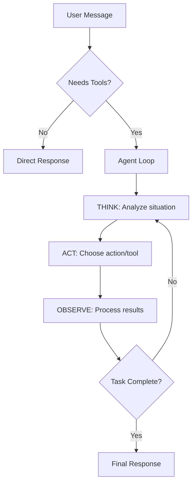

# Formmy Agent Framework

Un micro-framework de agentes AI desarrollado por Formmy que implementa el patrón ReAct con retry automático, optimización de contexto y manejo robusto de errores.

## 🚀 Características

- **Patrón ReAct mejorado**: Think → Act → Observe con memoria conversacional
- **Retry automático**: Manejo inteligente de errores con exponential backoff
- **Optimización de contexto**: Chunking y selección inteligente sin embeddings
- **Unified API**: Compatible con cualquier proveedor de AI (OpenAI, Anthropic, etc.)
- **Tool integration**: Sistema modular de herramientas
- **Sin dependencias**: ~500 líneas, completamente independiente
- **TypeScript nativo**: Tipos completos y validación estricta

## 📦 Instalación

```bash
npm install @formmy/agent-framework
```

## 🔧 Uso básico

### Configuración simple

```typescript
import { FormmyAgent, createAgent } from '@formmy/agent-framework';

// 1. Configurar proveedor de AI
const aiProvider = {
  async chatCompletion(request) {
    // Tu lógica de integración con OpenAI, Anthropic, etc.
    const response = await openai.chat.completions.create({
      model: request.model,
      messages: request.messages,
      temperature: request.temperature,
      max_tokens: request.maxTokens
    });
    
    return {
      content: response.choices[0].message.content,
      usage: {
        inputTokens: response.usage.prompt_tokens,
        outputTokens: response.usage.completion_tokens,
        totalTokens: response.usage.total_tokens
      }
    };
  }
};

// 2. Crear agente
const agent = createAgent({
  model: 'gpt-4',
  aiProvider: aiProvider,
  maxIterations: 5,
  contextLimit: 4000
});

// 3. Chat
const response = await agent.chat('¿Cómo puedo optimizar mi aplicación React?');
console.log(response.content);
```

### Uso con herramientas

```typescript
// Definir herramientas
const tools = [
  {
    name: 'search_web',
    description: 'Busca información en internet',
    execute: async (args, context) => {
      const results = await webSearch(args.query);
      return { message: `Encontré: ${results}` };
    }
  },
  {
    name: 'create_file',
    description: 'Crea un archivo',
    execute: async (args, context) => {
      await fs.writeFile(args.path, args.content);
      return { message: `Archivo ${args.path} creado exitosamente` };
    }
  }
];

// Crear agente con herramientas
const agent = createAgent({
  model: 'claude-3-haiku',
  aiProvider: aiProvider,
  tools: tools
});

const response = await agent.chat('Busca información sobre Next.js y créame un resumen en un archivo');
```

### Configuración avanzada

```typescript
const agent = createAgent({
  model: 'gpt-4',
  temperature: 0.7,
  maxIterations: 6,
  contextLimit: 5000,
  retryConfig: {
    maxRetries: 3,
    backoffMs: 1000,
    exponentialBackoff: true
  },
  aiProvider: customProvider,
  tools: myTools,
  callbacks: {
    onThought: (thought) => console.log('💭', thought.reasoning),
    onAction: (action) => console.log('⚡', action.type),
    onError: (error, context) => console.error('❌', error.message),
    onObservation: (obs) => console.log('👁️', obs.content)
  }
});
```

## 🏗️ Arquitectura

### Componentes principales

```
FormmyAgent
├── AgentCore          # Retry logic y manejo de errores
├── AgentExecutor      # Loop ReAct con memoria
├── ContextOptimizer   # Optimización de tokens
└── ContextChunker     # División inteligente de contexto
```

### Flujo de ejecución



## 🛠️ Configuraciones predefinidas

### Por modelo de AI

```typescript
import { MODEL_CONFIGS } from '@formmy/agent-framework';

// Configuraciones optimizadas incluidas:
// - gpt-5-nano: Ultra rápido, sin temperature
// - gpt-5-mini: Balanceado, temperature 0.3  
// - claude-3-haiku: Económico, temperature 0.7
// - claude-3.5-haiku: Mejorado, temperature 0.5
```

### Por plan de usuario

```typescript
import { getPlanConfig } from '@formmy/agent-framework';

const planLimits = getPlanConfig('PRO'); // FREE, STARTER, PRO, ENTERPRISE
// Auto-ajusta: maxIterations, contextLimit, retryConfig
```

## 🔧 API Reference

### FormmyAgent

#### Métodos principales

```typescript
// Chat principal
async chat(message: string, options?: ChatOptions): Promise<AgentResponse>

// Chat simplificado
async preview(message: string): Promise<string>

// Debug con información detallada  
async debug(message: string, options?: ChatOptions): Promise<{response: AgentResponse, debug: DebugInfo}>

// Estadísticas de configuración
getStats(): AgentStats

// Actualizar configuración
updateConfig(newConfig: Partial<AgentConfig>): void
```

#### Tipos principales

```typescript
interface AgentConfig {
  model: string;
  temperature?: number;
  maxIterations?: number;
  contextLimit?: number;
  retryConfig?: RetryConfig;
  tools?: Tool[];
  aiProvider?: AIProvider;
  callbacks?: AgentCallbacks;
}

interface ChatOptions {
  contexts?: ContextItem[];
  conversationHistory?: Message[];
  model?: string;
  stream?: boolean;
  user?: User;
  tools?: Tool[];
  toolsProvider?: (user: User, options: ChatOptions) => Promise<Tool[]>;
}

interface AgentResponse {
  content: string;
  toolsUsed?: string[];
  iterations?: number;
  usage?: TokenUsage;
  error?: string;
}
```

## 🎯 Casos de uso

### 1. Chatbot con herramientas específicas

```typescript
const supportAgent = createAgent({
  model: 'claude-3-haiku',
  aiProvider: claudeProvider,
  tools: [
    { name: 'search_kb', description: 'Buscar en base de conocimiento', execute: searchKB },
    { name: 'create_ticket', description: 'Crear ticket de soporte', execute: createTicket },
    { name: 'escalate', description: 'Escalar a humano', execute: escalateToHuman }
  ]
});
```

### 2. Agente de automatización

```typescript
const automationAgent = createAgent({
  model: 'gpt-4',
  aiProvider: openaiProvider,
  maxIterations: 8, // Más iteraciones para tareas complejas
  tools: [
    { name: 'run_script', execute: runScript },
    { name: 'send_email', execute: sendEmail },
    { name: 'update_database', execute: updateDB }
  ]
});
```

### 3. Agente de análisis

```typescript
const analyticsAgent = createAgent({
  model: 'gpt-5-mini',
  contextLimit: 8000, // Más contexto para análisis
  aiProvider: openaiProvider,
  tools: [
    { name: 'query_database', execute: queryDB },
    { name: 'generate_chart', execute: generateChart },
    { name: 'export_report', execute: exportReport }
  ]
});
```

## 🧪 Testing

```typescript
import { createTestAgent } from '@formmy/agent-framework';

// Agente configurado para testing (menos iteraciones, contexto reducido)
const testAgent = createTestAgent('gpt-4');

// Mock de proveedor para tests
const mockProvider = {
  chatCompletion: async (req) => ({ content: 'Test response' })
};

const agent = createAgent({
  model: 'test-model',
  aiProvider: mockProvider
});
```

## 🔍 Debug y monitoreo

```typescript
const agent = createAgent({
  model: 'gpt-4',
  aiProvider: provider,
  callbacks: {
    onThought: (thought) => {
      if (thought.confidence < 0.5) {
        console.warn('⚠️ Low confidence:', thought.reasoning);
      }
    },
    onError: (error, context) => {
      logger.error(`Agent error in ${context}:`, error);
    },
    onAction: (action) => {
      metrics.incrementCounter('agent_actions', { type: action.type });
    }
  }
});
```

## 🚀 Optimizaciones de rendimiento

### Context chunking inteligente

```typescript
// El framework automáticamente:
// 1. Divide contexto en chunks de 4KB
// 2. Selecciona chunks más relevantes por keywords
// 3. Optimiza tokens sin perder información crítica
// 4. Reduce costos de API hasta 70%
```

### Smart model routing

```typescript
// Detecta automáticamente:
// - Queries simples → Modelo rápido/económico
// - Queries complejas → Modelo potente
// - Integraciones activas → Modelo confiable
```

### Retry inteligente

```typescript
// Manejo automático de errores:
// - Rate limits → Exponential backoff
// - Respuestas vacías → Retry con mejor prompt
// - Tool failures → Fallback a respuesta directa
// - Context overflow → Chunk y retry
```

## 📄 Licencia

MIT © Formmy Team

## 🤝 Contribuir

```bash
git clone https://github.com/formmy/formmy
cd packages/formmy-agent-framework
npm install
npm run dev
```

## 📞 Soporte

- 📧 Email: hello@formmy.app
- 💬 Discord: https://discord.gg/formmy
- 📖 Docs: https://formmy.app/docs/agent-framework
- 🐛 Issues: https://github.com/formmy/formmy/issues

---

Desarrollado con ❤️ por el equipo de [Formmy](https://formmy.app)